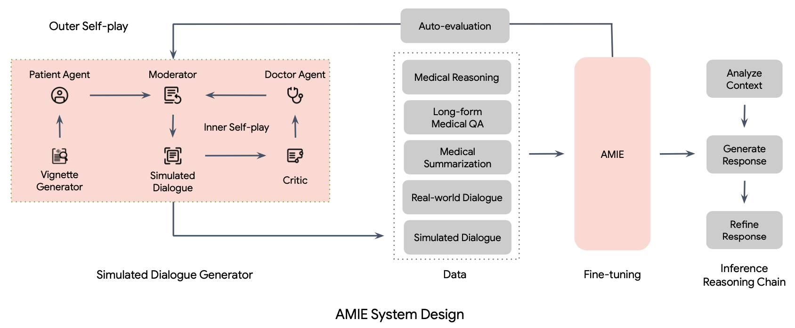

</img>

## AMIE - Pytorch (wip)

Implementation of the general framework for <a href="https://www.nature.com/articles/d41586-024-00099-4">AMIE</a>, from the paper <a href="https://arxiv.org/abs/2401.05654">Towards Conversational Diagnostic AI</a>, out of Google Deepmind

Reach out to me if you are at least a 3rd year medical student, have kept up with the current state of deep learning, and interested in this project.

## Todo

- [ ] allow for a DPO-like formulation. do not think google deepmind has adopted this across the org just yet.

## Citations

```bibtex
@inproceedings{Tu2024TowardsCD,
    title   = {Towards Conversational Diagnostic AI},
    author  = {Tao Tu and Anil Palepu and Mike Schaekermann and Khaled Saab and Jan Freyberg and Ryutaro Tanno and Amy Wang and Brenna Li and Mohamed Amin and Nenad Toma{\vs}ev and Shekoofeh Azizi and Karan Singhal and Yong Cheng and Le Hou and Albert Webson and Kavita Kulkarni and S Sara Mahdavi and Christopher Semturs and Juraj Gottweis and Joelle Barral and Katherine Chou and Greg S. Corrado and Yossi Matias and Alan Karthikesalingam and Vivek Natarajan},
    year    = {2024},
    url     = {https://api.semanticscholar.org/CorpusID:266933212}
}
```
